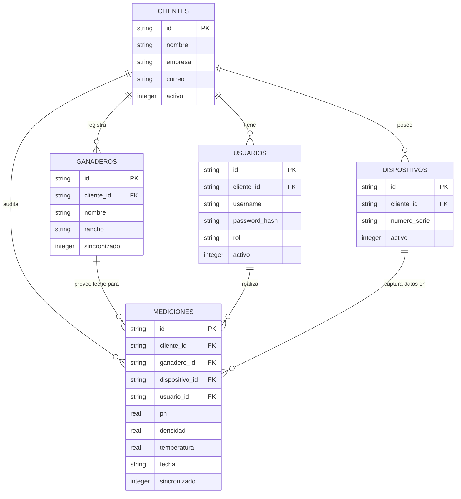

# Documentación de la Base de Datos BioScan (SQLite)

## 1. Resumen Ejecutivo
La base de datos de BioScan está diseñada bajo una arquitectura **Offline-First**, utilizando SQLite como motor de almacenamiento local en el dispositivo (móvil o escritorio) a través del paquete `sqflite`.

El propósito central es almacenar de manera robusta, consistente e indexada todas las mediciones capturadas por los sensores (densidad, temperatura, pH), garantizando que nunca se pierda información por falta de internet. Además de guardar los datos crudos, la base de datos gestiona relaciones jerárquicas multi-tenant mediante la entidad `clientes`, control de acceso con la tabla `usuarios`, y trazabilidad de los equipos con `dispositivos`. Todos los registros cuentan con un flag `sincronizado` para orquestar sincronizaciones eficientes con el backend.

## 2. Diccionario de Datos (Tablas y Campos)

### Tabla `clientes`
Gestiona la información de la organización (tenant) al que pertenece la aplicación.

| Campo | Tipo de Dato | Restricción | Descripción |
| :--- | :--- | :--- | :--- |
| `id` | `TEXT` | **PK**, UUID | Identificador único del cliente/organización. |
| `nombre` | `TEXT` | NOT NULL | Nombre oficial o comercial del cliente. |
| `empresa` | `TEXT` | NOT NULL | Razón social o nombre de la empresa asociada. |
| `telefono` | `TEXT` | NOT NULL | Número de contacto de la organización. |
| `correo` | `TEXT` | NOT NULL | Correo electrónico principal de la organización. |
| `fecha_registro` | `TEXT` | NOT NULL | Fecha (ISO 8601) en que se dio de alta el cliente en el sistema. |
| `activo` | `INTEGER`| NOT NULL, Default: 1 | Bandera booleana (1=Activo, 0=Inactivo) para desactivaciones lógicas. |

> **Nota de Sincronización Remota (Supabase):** En la nube de Supabase, esta tabla es mapeada y conocida como `cuentas`. El campo lógico `cliente_id` de toda la aplicación se traduce automáticamente a `cuenta_id` al sincronizar. Además, el campo `fecha_registro` lee el campo `created_at` de la nube.

### Tabla `usuarios`
Almacena las credenciales y perfiles de los operadores y administradores.

| Campo | Tipo de Dato | Restricción | Descripción |
| :--- | :--- | :--- | :--- |
| `id` | `TEXT` | **PK**, UUID | Identificador único del usuario. |
| `cliente_id` | `TEXT` | **FK** (clientes), NOT NULL | Organización a la que pertenece el usuario. |
| `username` | `TEXT` | NOT NULL | Nombre de usuario corto usado para el inicio de sesión. |
| `nombre` | `TEXT` | NOT NULL | Nombre y apellidos reales del usuario. |
| `correo` | `TEXT` | NOT NULL | Correo de recuperación y contacto del usuario. |
| `password_hash`| `TEXT` | NOT NULL | Hash criptográfico de la contraseña. |
| `salt` | `TEXT` | NOT NULL | Semilla (salt) utilizada durante el hashing de la contraseña. |
| `rol` | `TEXT` | NOT NULL | Perfil de permisos del usuario (ej. 'ADMIN', 'OPERADOR'). |
| `fecha_registro` | `TEXT` | NOT NULL | Fecha de creación de la cuenta en el sistema. |
| `ultimo_acceso`| `TEXT` | Nulo Permitido | Fecha y hora de su último inicio de sesión exitoso. |
| `activo` | `INTEGER`| NOT NULL, Default: 1 | Bandera booleana para bloquear acceso sin borrar el registro. |

### Tabla `ganaderos`
Representa a los productores a los que se les recolecta/analiza la leche.

| Campo | Tipo de Dato | Restricción | Descripción |
| :--- | :--- | :--- | :--- |
| `id` | `TEXT` | **PK**, UUID | Identificador único del ganadero. |
| `cliente_id` | `TEXT` | **FK** (clientes), NOT NULL | Identifica la cuenta recolectora del ganadero. |
| `nombre` | `TEXT` | NOT NULL | Primer y/o segundo nombre del ganadero. |
| `apellido_paterno`| `TEXT` | NOT NULL | Apellido paterno del productor. |
| `apellido_materno`| `TEXT` | NOT NULL | Apellido materno del productor. |
| `rancho` | `TEXT` | NOT NULL | Nombre de la granja, rancho o unidad de producción. |
| `telefono` | `TEXT` | NOT NULL | Teléfono de contacto directo del productor. |
| `correo` | `TEXT` | NOT NULL | Correo electrónico para envío de notificaciones/reportes. |
| `fecha_registro`| `TEXT` | NOT NULL | Fecha en que fue dado de alta en la app. |
| `sincronizado` | `INTEGER`| NOT NULL, Default: 0 | Bandera (0=Pendiente, 1=Subido) para control de respaldo en la nube. |

### Tabla `dispositivos`
Catálogo de sensores hardware (ESP32) autorizados y pareados con la aplicación.

| Campo | Tipo de Dato | Restricción | Descripción |
| :--- | :--- | :--- | :--- |
| `id` | `TEXT` | **PK**, UUID | Identificador lógico del equipo. |
| `cliente_id` | `TEXT` | **FK** (clientes), NOT NULL | Organización dueña del equipo. |
| `numero_serie` | `TEXT` | NOT NULL | MAC Address o Número de serie real del sensor (ej. `ESP32-A1B2`). |
| `nombre` | `TEXT` | NOT NULL | Nombre descriptivo asignado (ej. "Sensor Laboratorio 1"). |
| `modelo` | `TEXT` | NOT NULL | Modelo o versión de hardware del dispositivo. |
| `fecha_registro` | `TEXT` | NOT NULL | Cuándo se dio de alta en la base de datos. |
| `fecha_asignacion`| `TEXT` | Nulo Permitido | Cuándo fue asignado por última vez a un usuario/operador. |
| `activo` | `INTEGER`| NOT NULL, Default: 1 | Estado operativo del hardware. |

### Tabla `mediciones`
Contiene el registro crudo de cada análisis realizado a una muestra.

| Campo | Tipo de Dato | Restricción | Descripción |
| :--- | :--- | :--- | :--- |
| `id` | `TEXT` | **PK**, UUID | Identificador o Folio único de la medición. |
| `cliente_id` | `TEXT` | **FK** (clientes), NOT NULL | Organización bajo la cual se realiza la medición. |
| `ganadero_id` | `TEXT` | **FK** (ganaderos), NOT NULL | Productor de quien proviene la muestra evaluada. |
| `dispositivo_id`| `TEXT` | **FK** (dispositivos), Nulo Perm. | Hardware que recolectó los datos físicos. |
| `usuario_id` | `TEXT` | **FK** (usuarios), Nulo Perm. | Operador físico que manipuló la app durante la prueba. |
| `ph` | `REAL` | NOT NULL | Valor numérico del nivel de Acidez/Alcalinidad (ej. 6.6). |
| `densidad` | `REAL` | NOT NULL | Valor numérico de densidad o proporción de agua. |
| `temperatura` | `REAL` | NOT NULL | Temperatura de la muestra en °C al momento de medir. |
| `fecha` | `TEXT` | NOT NULL | Timestamp estricto (ISO 8601) del momento exacto del análisis. |
| `observaciones`| `TEXT` | NOT NULL | Notas libres ingresadas por el operador (puede ser string vacío). |
| `sincronizado` | `INTEGER`| NOT NULL, Default: 0 | Estado de replicación en nube externa. |
| `fecha_sincronizacion`| `TEXT`| Nulo Permitido | Cuándo subió con éxito el registro. |
| `pdf_path` | `TEXT` | Nulo Permitido | Ruta física local al archivo PDF de reporte autogenerado. |

## 3. Diagrama Relacional (ERD)

## 4. Flujo de Guardado de Mediciones

A continuación se describe el ciclo de vida transaccional cuando un operador guarda una medición desde la pantalla de resultados (`resultados_screen.dart` / `home_screen.dart`).

1. **Lectura de Sesión y Dispositivo (Queries Previas):**
   - El sistema obtiene la instancia del usuario actual (`usuario_id`) desde la caché de autenticación o la tabla `usuarios`.
   - Se valida la organización activa (`cliente_id`) del contexto para adjuntar el tenant a la medición.
   - El ID del ganadero se selecciona previamente en la UI desde la tabla `ganaderos`.

2. **Creación en Memoria del Objeto `Medicion`:**
   - La aplicación recolecta los buffers de datos Bluetooth finales o simulados de la balanza/sensor (densidad, temperatura, pH).
   - Crea un DTO en Dart (`Medicion`) parseando las lecturas de los sensores.

3. **Invocación al DAO (`MedicionDao.insert`):**
   - La función convierte el objeto a un Map (Diccionario) transformando variables en `camelCase` (de memoria) a `snake_case` (de la base de datos).
   - Los datos como `temperatura` y `ph` que provienen como strings de la interfaz, se castean mediante `double.tryParse` o se persisten asegurando su formato numérico en la instrucción SQL.

4. **Transacción SQLite:**
   - Se ejecuta internamente `db.insert('mediciones', ...)`.
   - Si se incluye una regla de colisión (`ConflictAlgorithm.replace`), se sobreescribe el ID si ya existiera en una actualización post-medición (ej. agregar observaciones).

5. **Generación Documental Posterior (Opcional):**
   - Si se visualiza el ticket en PDF, se guarda físicamente en caché (`PdfReportService`). 
   - Se ejecuta un `db.update('mediciones')` apuntando únicamente a rellenar la columna `pdf_path` con la ubicación del archivo local.
   
6. **Módulo de Sincronización (Background):**
   - Un hilo paralelo (Timer) detecta la fila con `sincronizado = 0`. Intenta subir la carga a Supabase/API remota. Tras el éxito, ejecuta una consulta de tipo `UPDATE mediciones SET sincronizado = 1, fecha_sincronizacion = NOW() WHERE id = ?`.
