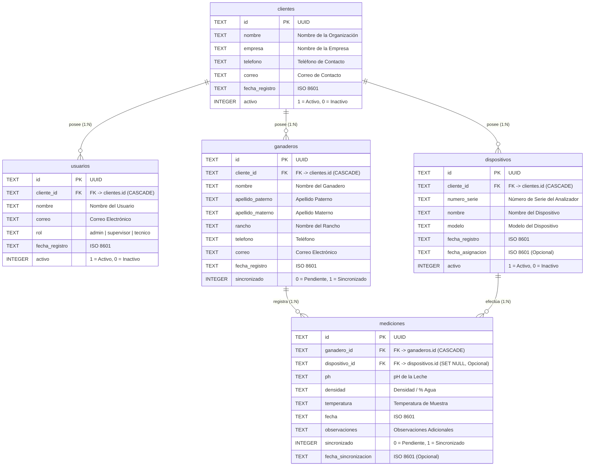

# BioScan — Arquitectura Multi-Cliente

BioScan es una aplicación móvil desarrollada en Flutter para la medición y control de calidad de leche a través de sensores Bluetooth y análisis en tiempo real. 

Esta versión implementa una **Arquitectura Multi-Cliente / Multi-Tenant**, permitiendo aislar la información de distintas empresas, organizaciones, queserías o centros de acopio en una misma base de datos local (SQLite).

---

## 🏗️ Arquitectura de la Base de Datos

El sistema funciona bajo un paradigma **Local-First**, permitiendo la captura offline de mediciones y ganaderos con marcado de sincronización (`sincronizado`, `fecha_sincronizacion`) para replicar con el backend remoto (Supabase / PostgreSQL) cuando haya conectividad.



---

## 📋 Tablas y Campos

### 1. `clientes`
Representa a cada organización o entidad que utiliza BioScan.
* **`id`** (`TEXT PRIMARY KEY`): Identificador único (UUID).
* **`nombre`** (`TEXT NOT NULL`): Nombre comercial u organizacional.
* **`empresa`** (`TEXT NOT NULL`): Razón social o denominación de la empresa.
* **`telefono`** (`TEXT NOT NULL`): Teléfono de contacto.
* **`correo`** (`TEXT NOT NULL`): Correo de contacto.
* **`fecha_registro`** (`TEXT NOT NULL`): Fecha ISO 8601 de alta.
* **`activo`** (`INTEGER NOT NULL DEFAULT 1`): Control de activación/desactivación sin pérdida de historial.

### 2. `usuarios`
Representa a los operadores o personal del cliente.
* **`id`** (`TEXT PRIMARY KEY`): Identificador único (UUID).
* **`cliente_id`** (`TEXT NOT NULL`, `FK` $\to$ `clientes.id` `ON DELETE CASCADE`): Cliente propietario.
* **`nombre`** (`TEXT NOT NULL`): Nombre del operador/usuario.
* **`correo`** (`TEXT NOT NULL`): Correo del usuario.
* **`rol`** (`TEXT NOT NULL`): Rol dentro de la plataforma (`admin`, `supervisor`, `tecnico`).
* **`fecha_registro`** (`TEXT NOT NULL`): Fecha ISO 8601.
* **`activo`** (`INTEGER NOT NULL DEFAULT 1`): Estado del usuario.

### 3. `dispositivos`
Registra los analizadores físicos o sensores BioScan pertenecientes a un cliente.
* **`id`** (`TEXT PRIMARY KEY`): Identificador único (UUID).
* **`cliente_id`** (`TEXT NOT NULL`, `FK` $\to$ `clientes.id` `ON DELETE CASCADE`): Cliente asignado.
* **`numero_serie`** (`TEXT NOT NULL`): Número de serie del hardware.
* **`nombre`** (`TEXT NOT NULL`): Nombre asignado al dispositivo.
* **`modelo`** (`TEXT NOT NULL`): Modelo del sensor.
* **`fecha_registro`** (`TEXT NOT NULL`): Fecha ISO 8601 de alta.
* **`fecha_asignacion`** (`TEXT`): Fecha de vinculación al cliente.
* **`activo`** (`INTEGER NOT NULL DEFAULT 1`): Estado del equipo.

### 4. `ganaderos`
Registra los ganaderos asociados a un cliente específico.
* **`id`** (`TEXT PRIMARY KEY`): UUID del ganadero.
* **`cliente_id`** (`TEXT NOT NULL`, `FK` $\to$ `clientes.id` `ON DELETE CASCADE`): Cliente al que pertenece el ganadero.
* **`nombre`**, **`apellido_paterno`**, **`apellido_materno`** (`TEXT NOT NULL`): Nombre completo.
* **`rancho`** (`TEXT NOT NULL`): Nombre del rancho o predio.
* **`telefono`**, **`correo`** (`TEXT NOT NULL`): Datos de contacto.
* **`fecha_registro`** (`TEXT NOT NULL`): Fecha ISO 8601.
* **`sincronizado`** (`INTEGER NOT NULL DEFAULT 0`): Estado de sincronización remota.

### 5. `mediciones`
Registra las pruebas analíticas tomadas a las muestras de leche.
* **`id`** (`TEXT PRIMARY KEY`): UUID de la medición.
* **`ganadero_id`** (`TEXT NOT NULL`, `FK` $\to$ `ganaderos.id` `ON DELETE CASCADE`): Ganadero evaluado.
* **`dispositivo_id`** (`TEXT`, `FK` $\to$ `dispositivos.id` `ON DELETE SET NULL`): Dispositivo analizador utilizado (opcional).
* **`ph`**, **`densidad`**, **`temperatura`** (`TEXT NOT NULL`): Valores analíticos medidos.
* **`fecha`** (`TEXT NOT NULL`): Fecha ISO 8601 del muestreo.
* **`observaciones`** (`TEXT NOT NULL`): Comentarios u observaciones.
* **`sincronizado`** (`INTEGER NOT NULL DEFAULT 0`): Estado de sincronización remota.
* **`fecha_sincronizacion`** (`TEXT`): Fecha ISO 8601 de la sincronización efectuada.

---

## 🛡️ Aislamiento y Multi-Tenancy

Cada consulta a través de los repositorios (`GanaderoRepository.getGanaderosByCliente`, `MedicionRepository.getMedicionesByCliente`, etc.) está estrictamente delimitada por el `cliente_id` del cliente seleccionado en la navegación principal. Esto asegura que la información de una organización no se cruce con la de otra.

## 🔄 Migración de Base de Datos (v1 a v2)

Al actualizar la aplicación desde la versión 1, el migrador automático ([database_migrator.dart](file:///Users/cesaron/Documents/GitHub/BioScan/lib/database/migrations/database_migrator.dart)):
1. Crea las tablas `clientes`, `usuarios` y `dispositivos`.
2. Inserta el `"Cliente Predeterminado"` (`default-cliente-001`).
3. Agrega la columna `cliente_id` a `ganaderos` con valor predeterminado `default-cliente-001`.
4. Agrega la columna `dispositivo_id` a `mediciones` (permitiendo valores nulos).

De este modo, **ningún registro ni historial preexistente es eliminado o alterado**.

---

## 🧪 Pruebas Automatizadas

Para ejecutar el conjunto de pruebas unitarias e integrales de la base de datos:

```bash
flutter test
```
